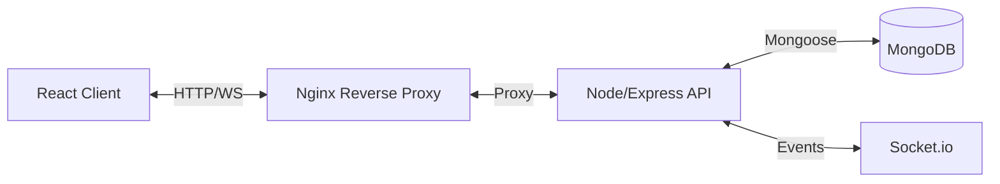

# Quick Commerce Platform (QuickMato)

## 1. Project Overview

This is a full-stack "Quick Commerce" application designed to facilitate rapid delivery services. The platform supports three distinct user roles, each with a tailored dashboard:

*   **Customer**: Browse products, place orders, and track delivery status in real-time.
*   **Delivery Partner**: View available orders in a pool, accept deliveries, and update status (Picked Up, On Way, Delivered).
*   **Admin**: distinct oversight of the entire system, view all orders, and manage delivery partners (list/delete).

The system emphasizes real-time synchronization using WebSockets, ensuring that all parties see the latest status instantly without refreshing.

## 2. System Architecture

The application follows a containerized microservices-style architecture, orchestrated by Docker Compose:



## 3. Stack Used

*   **Frontend**: React.js (Create React App), Context API for state, Socket.io-client.
*   **Backend**: Node.js, Express.js.
*   **Database**: MongoDB (Mongoose ODM).
*   **Real-time**: Socket.io.
*   **Containerization**: Docker, Docker Compose.
*   **Server**: Nginx (as a reverse proxy and static file server in production).

## 4. Folder Structure

```
quick-commerce/
├── backend/                # Node.js API
│   ├── src/
│   │   ├── config/         # DB connection
│   │   ├── controllers/    # Route logic
│   │   ├── middleware/     # Auth & Error handling
│   │   ├── models/         # Mongoose Schemas
│   │   ├── routes/         # API Endpoints
│   │   └── utils/
│   ├── index.js            # Entry point
│   ├── Dockerfile
│   └── package.json
│
├── frontend/               # React App
│   ├── src/
│   │   ├── api/            # Axios setup
│   │   ├── components/     # Reusable UI components
│   │   ├── context/        # Auth, Socket, Cart contexts
│   │   ├── pages/          # Dashboard views
│   │   └── App.js
│   ├── Dockerfile
│   └── package.json
│
├── nginx/                  # Nginx Configuration
│   └── nginx.conf
└── docker-compose.yml      # Container orchestration
```

## 5. Setup Instructions

### Prerequisites
*   Git
*   Docker & Docker Compose

### Step 1: Clone the Repository
```bash
git clone https://github.com/notoriousmb10/quick-commerce.git
cd quick-commerce
```

### Step 2: Configure Environment Variables
Create a `.env` file in the `backend/` directory:
```env
PORT=5000
MONGO_URI=mongodb://mongo:27017/quick-commerce
JWT_SECRET=your_super_secret_key
CLIENT_URL=http://localhost:3000
```
*(Note: In docker-compose, the internal mongo host is usually just `mongo`)*

### Step 3: Run with Docker Compose
This command will build the images and start the containers (Frontend, Backend, MongoDB, Nginx).
```bash
docker-compose up --build
```
*   The application will be accessible at `http://localhost` (via Nginx) or `http://localhost:3000` (direct React dev server if mapped).
*   API runs at `http://localhost:5000`.

If you clone this and plan to deploy then follow the below steps -> 
### SSH / Server Login (If deploying)
```bash
ssh -i pem key user@your-server-ip (Mention your aws ip if you deploy) 
# Follow the clone and docker-compose steps above
```

## 6. Hosting & Deployment Steps

### Provision a Server
Create an AWS EC2 instance (Ubuntu LTS recommended) and allow ports 22, 80, and 443 in the security group.

### Install Docker & Docker Compose
```bash
sudo apt update
sudo apt install docker.io docker-compose
```

### Initial Deployment (Manual)
1.  **SSH** into the EC2 instance.
2.  **Clone** the repository to the server.
3.  **Configure production environment variables** in the backend.
4.  Start the application using Docker Compose:
    ```bash
    docker-compose up -d --build
    ```

### Automated Deployment (GitHub Actions)
An automated deployment pipeline is configured using GitHub Actions.
*   The workflow triggers when a version tag (for example `v1.0.0`) is pushed to the repository.
*   GitHub Actions connects to the EC2 instance using SSH credentials stored securely in GitHub Secrets.
*   The server checks out the tagged release and rebuilds the Docker containers using Docker Compose.
*   This allows deploying new versions without manually logging into the server each time.

### Domain Setup (Optional)
Point the domain’s A record to the EC2 public IP address.

### SSL Configuration (Optional)
HTTPS can be enabled using Certbot and Let’s Encrypt, either on the host machine or integrated with the Nginx container.

## 7. WebSocket Flow Explanation

The real-time logic handles the order lifecycle:

1.  **Order Placed**: Customer submits order -> Server saves to DB -> Emits `new_order_available` event.
2.  **Notification**: All connected Partners receive `new_order_available` and their availability list updates automatically.
3.  **Acceptance**: A Partner accepts -> Server emits `order_accepted_by_partner`. The order is removed from the "Available" pool for others.
4.  **Status Updates**: Partner clicks "Picked Up" / "Delivered" -> Server emits `order_update`. Customer and Admin dashboards reflect the new status immediately.

## 8. Scaling Plan

To scale this application for thousands of concurrent users:

### Horizontal Scaling
At present, the application is running on a single EC2 instance using Docker Compose, which is enough for learning purpose, demos, and low traffic usage. I have not implemented horizontal scaling or load balancers in this project because I am still learning these concepts and wanted to keep the deployment simple and stable. From what I understand, when the traffic increases, the backend can be scaled by running multiple backend instances, and a load balancer like AWS Application Load Balancer or Nginx can be used in front of them to distribute incoming requests. This helps the system handle more users and also improves reliability. I also understand that WebSockets need the client to stay connected to the same backend server, so sticky sessions are required when using a load balancer. I do not have hands-on experience with this yet, but the current architecture is designed in a way that makes it possible to add load balancing and horizontal scaling later when needed.

### Redis Adapter for WebSockets
In the current implementation, the application runs with a single backend instance, so Socket.io works without any additional coordination layer. All connected clients communicate with the same server, and real-time events such as order updates are emitted and received correctly. However, if the backend is scaled horizontally and multiple Node.js instances are running, WebSocket connections would become isolated to individual servers. In that scenario, a client connected to one backend instance would not automatically receive events emitted from another instance. To handle this, Redis can be introduced as a shared message broker using the Socket.io Redis adapter. Each backend instance would connect to the same Redis server, and when an event is emitted on one instance, it would be published to Redis and propagated to all other instances. This ensures that real-time updates remain consistent across the entire system. Redis was not implemented in this project since it operates with a single backend instance, but the architecture allows it to be added easily when scaling is required.

## 9. Future Improvements
*   **Push Notifications**: Integrate Firebase (FCM) or browser notifications for offline updates.
*   **Analytics Dashboard**: Visual charts for Admin to view daily orders/revenue (Since the application isnt heavily oriented towards UI).
*   **Payment Integration**: Add Stripe/Razorpay for real payments.
*   **Maps Integration**: Show live driver location on a map using Google Maps API.
