# Quick Commerce Platform

## 1. Project Overview

This is a full-stack "Quick Commerce" application designed to facilitate rapid delivery services. The platform supports three distinct user roles, each with a tailored dashboard:

*   **Customer**: Browse products, place orders, and track delivery status in real-time.
*   **Delivery Partner**: View available orders in a pool, accept deliveries, and update status (Picked Up, On Way, Delivered).
*   **Admin**: distinct oversight of the entire system, view all orders, and manage delivery partners (list/delete).

The system emphasizes real-time synchronization using WebSockets, ensuring that all parties see the latest status instantly without refreshing.

## 2. System Architecture

The application follows a containerized microservices-style architecture, orchestrated by Docker Compose:

```mermaid
graph LR
    Client[React Client] <-->|HTTP/WS| Nginx[Nginx Reverse Proxy]
    Nginx <-->|Proxy| Backend[Node/Express API]
    Backend <-->|Mongoose| DB[(MongoDB)]
    Backend <-->|Events| Socket[Socket.io]
```



## 3. Stack Used

*   **Frontend**: React.js (Create React App), Context API for state, Socket.io-client.
*   **Backend**: Node.js, Express.js.
*   **Database**: MongoDB (Mongoose ODM).
*   **Real-time**: Socket.io.
*   **Containerization**: Docker, Docker Compose.
*   **Server**: Nginx (as a reverse proxy and static file server in production).

## 4. Folder Structure

```
quick-commerce/
├── backend/                # Node.js API
│   ├── src/
│   │   ├── config/         # DB connection
│   │   ├── controllers/    # Route logic
│   │   ├── middleware/     # Auth & Error handling
│   │   ├── models/         # Mongoose Schemas
│   │   ├── routes/         # API Endpoints
│   │   └── utils/
│   ├── index.js            # Entry point
│   ├── Dockerfile
│   └── package.json
│
├── frontend/               # React App
│   ├── src/
│   │   ├── api/            # Axios setup
│   │   ├── components/     # Reusable UI components
│   │   ├── context/        # Auth, Socket, Cart contexts
│   │   ├── pages/          # Dashboard views
│   │   └── App.js
│   ├── Dockerfile
│   └── package.json
│
├── nginx/                  # Nginx Configuration
│   └── nginx.conf
└── docker-compose.yml      # Container orchestration
```

## 5. Setup Instructions

### Prerequisites
*   Git
*   Docker & Docker Compose

### Step 1: Clone the Repository
```bash
git clone https://github.com/yourusername/quick-commerce.git
cd quick-commerce
```

### Step 2: Configure Environment Variables
Create a `.env` file in the `backend/` directory:
```env
PORT=5000
MONGO_URI=mongodb://mongo:27017/quick-commerce
JWT_SECRET=your_super_secret_key
CLIENT_URL=http://localhost:3000
```
*(Note: In docker-compose, the internal mongo host is usually just `mongo`)*

### Step 3: Run with Docker Compose
This command will build the images and start the containers (Frontend, Backend, MongoDB, Nginx).
```bash
docker-compose up --build
```
*   The application will be accessible at `http://localhost` (via Nginx) or `http://localhost:3000` (direct React dev server if mapped).
*   API runs at `http://localhost:5000`.

### SSH / Server Login (If deploying)
```bash
ssh user@your-server-ip
# Follow the clone and docker-compose steps above
```

## 6. Hosting & Deployment Steps

1.  **Provision a Server**:AWS EC2 (Ubuntu LTS recommended).
2.  **Install Docker**:
    ```bash
    sudo apt update
    sudo apt install docker.io docker-compose
    ```
3.  **Deploy**:
    *   Clone your repo to the server.
    *   Set up production `.env` variables.
    *   Run `docker-compose up -d --build` to start in detached mode.
4.  **Domain Setup**: Point your domain's A record to the server IP.
5.  **SSL**: Use Certbot to generate SSL certificates (can be integrated into Nginx container).

## 7. WebSocket Flow Explanation

The real-time logic handles the order lifecycle:

1.  **Order Placed**: Customer submits order -> Server saves to DB -> Emits `new_order_available` event.
2.  **Notification**: All connected Partners receive `new_order_available` and their availability list updates automatically.
3.  **Acceptance**: A Partner accepts -> Server emits `order_accepted_by_partner`. The order is removed from the "Available" pool for others.
4.  **Status Updates**: Partner clicks "Picked Up" / "Delivered" -> Server emits `order_update`. Customer and Admin dashboards reflect the new status immediately.

## 8. Scaling Plan

To scale this application for thousands of concurrent users:

### Horizontal Scaling
In the current implementation, the application runs with a single backend instance, so Socket.io works without any extra coordination layer. All the connected clients communicate with the same server, and real-time events like order updates are emitted and received correctly. However, if the backend is scaled horizontally and multiple Node.js instances are running, WebSocket connections would be isolated to individual servers. In that case, a client connected to one backend instance would not receive events emitted from another instance automatically. To solve this problem, Redis can be used as a shared message broker using the Socket.io Redis adapter. Each backend instance connects to the same Redis server, and when an event is emitted on one server, it gets published to Redis and then propagated to other backend instances. This helps in keeping real-time updates consistent across the system. Redis is not implemented in this project since it currently runs on a single backend instance, but the architecture allows it to be added easily in future when scaling is required.

### Redis Adapter for WebSockets
In the current implementation, the application runs with a single backend instance, so Socket.io works without any additional coordination layer. All connected clients communicate with the same server, and real-time events such as order updates are emitted and received correctly. However, if the backend is scaled horizontally and multiple Node.js instances are running, WebSocket connections would become isolated to individual servers. In that scenario, a client connected to one backend instance would not automatically receive events emitted from another instance. To handle this, Redis can be introduced as a shared message broker using the Socket.io Redis adapter. Each backend instance would connect to the same Redis server, and when an event is emitted on one instance, it would be published to Redis and propagated to all other instances. This ensures that real-time updates remain consistent across the entire system. Redis was not implemented in this project since it operates with a single backend instance, but the architecture allows it to be added easily when scaling is required.

## 9. Future Improvements
*   **Push Notifications**: Integrate Firebase (FCM) or browser notifications for offline updates.
*   **Analytics Dashboard**: Visual charts for Admin to view daily orders/revenue.
*   **Payment Integration**: Add Stripe/Razorpay for real payments.
*   **Maps Integration**: Show live driver location on a map using Google Maps API.
